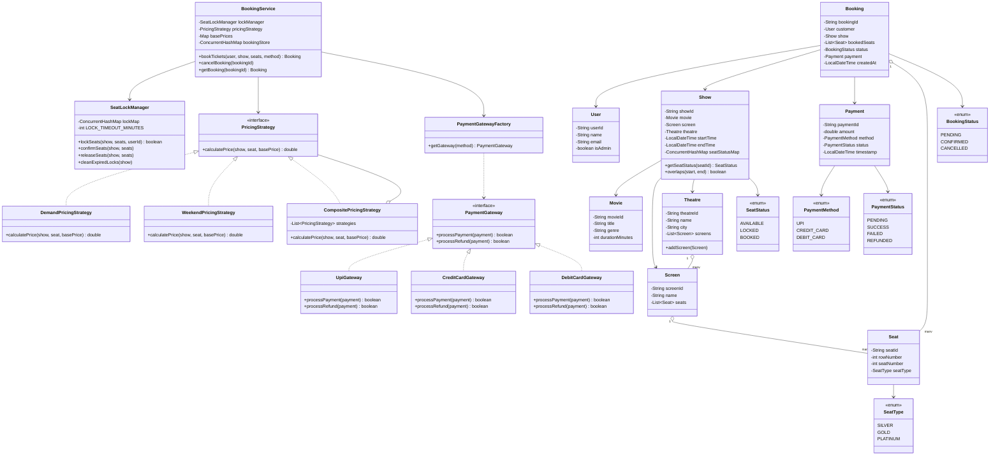

# BookMyShow — Movie Ticket Booking System (LLD)

A low-level design for a movie ticket booking system, written in Java. The focus is on clean class design, handling concurrent bookings safely, and flexible pricing without hardcoding rules.

## How to Run

```bash
cd bookmyshow/src
javac com/bookmyshow/**/*.java com/bookmyshow/App.java
java com.bookmyshow.App
```

The driver (`App.java`) runs a full end-to-end scenario — adds movies, a theatre with screens, creates shows, tests overlap detection, does actual bookings, cancellation with refund, and a two-thread race for the same seats.

---

## What's Covered

- Admin can add movies, theatres (with multiple screens), and shows
- Shows on the same screen can't overlap — the system throws on scheduling conflict
- Customers can browse by city, check seat layout, book tickets, and cancel
- Seat locking during checkout: a 5-minute hold prevents two users from booking the same seat simultaneously
- Cancellation triggers a refund via the same payment method used to book
- Pricing is dynamic — demand surge (based on how full the hall is) + weekend surcharge. If both apply, the higher one wins
- Payment supports UPI, Credit Card, Debit Card via a factory — easy to add more gateways

---

## Design Patterns Used

| Pattern | Where |
|---|---|
| Strategy | `PricingStrategy` — demand-based and weekend rules are separate strategies, composed via `CompositePricingStrategy` |
| Factory | `PaymentGatewayFactory` — returns the right gateway based on payment method |
| Locking | `SeatLockManager` — uses `synchronized(show)` so concurrent booking attempts on the same show are serialized |

---

## UML Class Diagram



---

## Booking Flow (Sequence)

```
User calls BookingService.bookTickets()
  |
  ├─ SeatLockManager.lockSeats()        → synchronized on Show object
  |                                        if any seat is BOOKED or LOCKED (and not expired) → throws
  |
  ├─ PricingStrategy.calculatePrice()   → for each seat (demand + weekend, takes max)
  |
  ├─ PaymentGatewayFactory.getGateway() → picks UPI / Credit / Debit
  ├─ gateway.processPayment()
  |    └─ if fails → releaseSeats() + throw PaymentFailedException
  |
  ├─ SeatLockManager.confirmSeats()     → LOCKED → BOOKED
  └─ returns Booking (CONFIRMED)

Cancellation:
  BookingService.cancelBooking()
  ├─ SeatLockManager.releaseSeats()     → BOOKED → AVAILABLE
  └─ gateway.processRefund()            → refunds to original payment method
```

---

## Assumptions

- Everything is in-memory, no database
- Payment gateways always succeed (simulated)
- Single JVM — no distributed locking needed
- Lock timeout is fixed at 5 minutes
