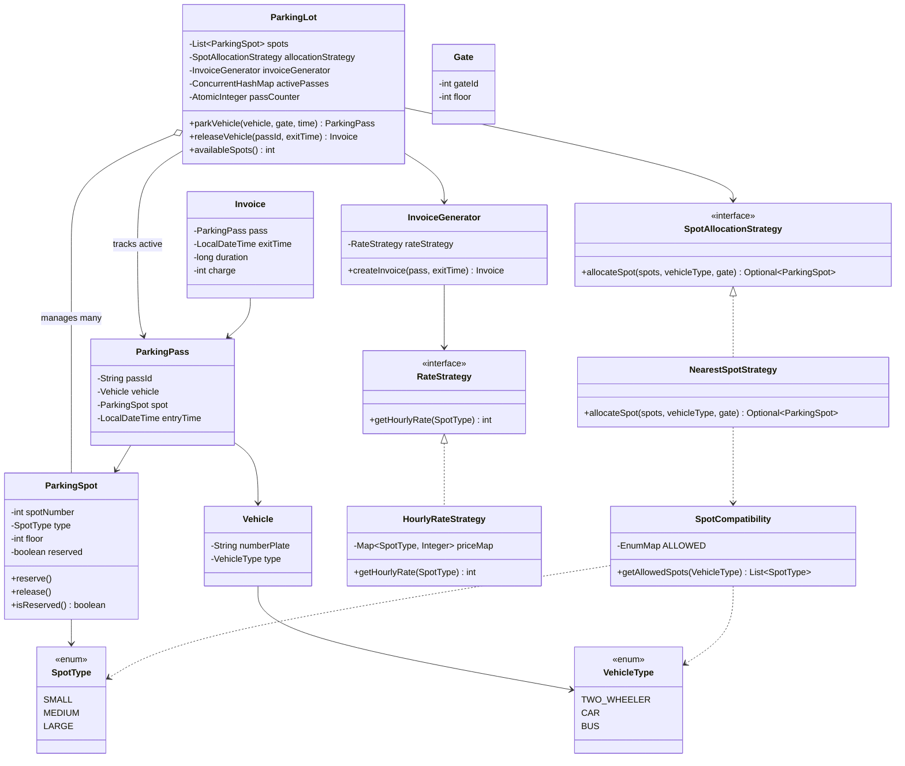

# Parking Lot — Low Level Design

A multi-floor parking lot system in Java. Handles vehicle entry/exit, smart spot allocation based on which gate you drive through, overflow when your spot type is full, and hourly billing.

## How to Run

```bash
cd parking-lot/src
javac *.java
java ParkingLotDemo
```

---

## What's Inside

- Multi-floor layout with SMALL, MEDIUM, and LARGE spots
- Three vehicle types: TWO_WHEELER, CAR, BUS — each has a list of compatible spot sizes
- Spot allocation picks the nearest available spot relative to the entry gate's floor (less walking)
- Overflow: if a bike's preferred SMALL spot is full, it falls through to MEDIUM, then LARGE
- Hourly billing — rounded up, minimum 1 hour
- Pass-based tracking: entry gives you a `PASS-N`, exit takes the pass and generates an invoice
- `availableSpots()` lets you check remaining capacity at any point

---

## Design Patterns

| Pattern | Where |
|---|---|
| Strategy | `SpotAllocationStrategy` — swap out `NearestSpotStrategy` for any other allocation logic without touching `ParkingLot` |
| Strategy | `RateStrategy` — `HourlyRateStrategy` is pluggable; a peak-hour or subscription strategy would slot right in |
| Dependency Injection | `ParkingLot` receives both strategies via constructor — nothing is hardcoded |

---

## UML Class Diagram



---

## Spot Compatibility

A vehicle can only go in certain spot sizes. If the preferred size is full, it naturally falls through to the next compatible one.

| Vehicle | Compatible Spot Sizes |
|---|---|
| TWO_WHEELER | SMALL → MEDIUM → LARGE |
| CAR | MEDIUM → LARGE |
| BUS | LARGE only |

---

## Billing

Rates are set in `ParkingLotDemo.java` and passed into `HourlyRateStrategy`. Duration is always rounded up to the next full hour, minimum 1 hour.

| Spot | Rate / hour |
|---|---|
| SMALL | Rs. 10 |
| MEDIUM | Rs. 20 |
| LARGE | Rs. 50 |

---

## Files

| File | What it does |
|---|---|
| `ParkingLot.java` | Core — entry, exit, pass management |
| `ParkingSpot.java` | A single spot with type, floor, reserved state |
| `Vehicle.java` | Number plate + vehicle type |
| `Gate.java` | Entry gate with its floor number |
| `ParkingPass.java` | Issued on entry, handed back on exit |
| `Invoice.java` | Exit receipt with duration and charge |
| `InvoiceGenerator.java` | Computes duration and delegates to rate strategy |
| `NearestSpotStrategy.java` | Picks the closest free compatible spot to the entry gate |
| `SpotCompatibility.java` | Maps vehicle type → allowed spot sizes |
| `HourlyRateStrategy.java` | Returns the per-hour rate for a spot type |
| `RateStrategy.java` | Interface for billing |
| `SpotAllocationStrategy.java` | Interface for allocation |
| `SpotType.java` | Enum: SMALL, MEDIUM, LARGE |
| `VehicleType.java` | Enum: TWO_WHEELER, CAR, BUS |
| `ParkingLotDemo.java` | Driver — runs the full scenario |
