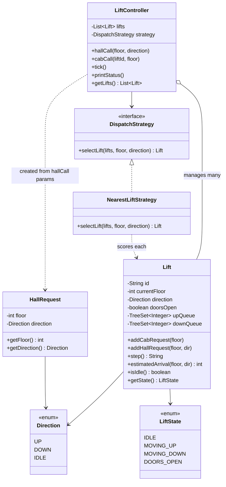

# Elevator System — Low Level Design

A multi-lift elevator system in Java. Three lifts share a 10-floor building and serve both hall calls (buttons on floors) and cab calls (buttons inside a lift). Dispatch picks the smartest lift for each request, and each lift runs the SCAN algorithm to decide which floors to stop at.

## How to Run

```bash
cd elevator/src
javac *.java
java ElevatorDemo
```

The demo runs four scenarios: a basic ride, the SCAN algorithm in isolation, dispatch correctness, and three lifts working concurrently.

---

## How It Works

### SCAN (LOOK) algorithm
Each lift keeps two queues:
- `upQueue` — floors to stop at while travelling UP (served in ascending order)
- `downQueue` — floors to stop at while travelling DOWN (served in descending order)

When a floor is added, it goes into the queue that matches its *physical position* relative to the lift (above → upQueue, below → downQueue). The lift sweeps UP until `upQueue` is exhausted, then flips to sweep DOWN, and so on. This prevents starvation and minimises total travel.

### Dispatch
`NearestLiftStrategy` scores every lift for a given request:
- Idle lift on the correct side (below for UP calls, above for DOWN calls) → score = distance
- Lift already heading the right way and the floor is still ahead → score = distance
- All other cases → score = 1000 + distance (big penalty)

The lift with the lowest score wins.

### Routing rule
Stops are placed in the queue based on **position**, not the passenger's intended direction. The direction only matters when the dispatcher is choosing which lift to send. Once the lift accepts a request, it just needs to reach the floor — the queue it lands in is determined by whether the floor is above or below the lift's current position.

---

## Design Patterns

| Pattern | Where |
|---|---|
| Strategy | `DispatchStrategy` interface — `NearestLiftStrategy` is pluggable; any other algorithm (round-robin, load-balanced) slots in without touching `LiftController` |
| Dependency Injection | `LiftController` receives the dispatch strategy through its constructor |
| Single Responsibility | `Lift` owns movement logic, `LiftController` owns dispatch and coordination, `ElevatorDemo` owns the scenario setup |

---

## UML Class Diagram



---

## Flow — What Happens on a Hall Call

```
User presses UP at floor 4
  |
  LiftController.hallCall(4, UP)
  |
  ├─ NearestLiftStrategy.selectLift(lifts, 4, UP)
  |       scores each lift → picks lowest
  |       (idle lift below floor 4 wins)
  |
  ├─ chosen.addHallRequest(4, UP)
  |       floor 4 > currentFloor → upQueue.add(4)
  |       wakeIfIdle → direction = UP
  |
  └─ each tick → LiftController.tick() → lift.step()
          ▲ moves floor by floor
          ▲ STOP floor 4 — doors open
          doors close
          continues UP run (or flips to DOWN if upQueue exhausted)
```

---

## Files

| File | What it does |
|---|---|
| `Lift.java` | Single lift — SCAN queues, step-by-step movement, arrival estimation |
| `LiftController.java` | Coordinates all lifts — hall calls, cab calls, ticking |
| `NearestLiftStrategy.java` | Picks the lift with the lowest estimated arrival time |
| `DispatchStrategy.java` | Interface — swap in any dispatch algorithm |
| `HallRequest.java` | Represents a floor button press (floor + intended direction) |
| `Direction.java` | Enum: UP, DOWN, IDLE |
| `LiftState.java` | Enum: IDLE, MOVING_UP, MOVING_DOWN, DOORS_OPEN |
| `ElevatorDemo.java` | Driver — four scenarios showing different aspects of the system |

---

## Assumptions

- In-memory simulation, one tick = one floor of movement
- Doors open for one tick then close the next
- No weight limits or capacity checks
- Lift stays at its last position when idle (doesn't return to ground)
- `NearestLiftStrategy` is a greedy heuristic — good enough for a single building, not optimal for all cases
